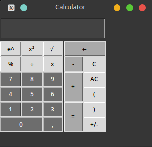
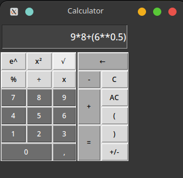
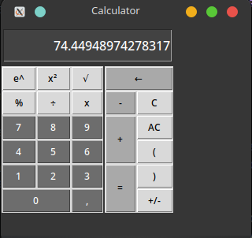

# Simple Calculator App

This is a simple calculator application built using Python and Tkinter.

## Features

- **Basic Arithmetic Operations**: Addition, Subtraction, Multiplication, Division
- **Exponential Operations**: Square, Square Root
- **Percentage Calculation**
- **Clear and Undo Functionality**
- **Input Validation**: Restricts invalid characters in the input field

## Requirements

- Python 3.11.6
- Tkinter (usually comes pre-installed with Python)

## Usage

1. Clone the repository or download the `app.py` file.
2. Run the `app.py` file using Python.
3. The calculator interface will appear, allowing you to perform calculations.

## Usage Example

## How to Use

- **Numeric Buttons**: Click on the numeric buttons (0-9) to enter numbers into the display.
- **Arithmetic Operations**: Click on the respective buttons (+, -, *, /) to perform calculations.
- **Special Operations**: Use the special buttons (%, √, x²) for percentage, square root, and square operations.
- **Undo**: Click the backspace (←) button to remove the last entered digit.
- **Clear Display**: Click on "C" or "AC" buttons to clear the display.
- **Change Sign**: Click on "+/-" to toggle between positive and negative numbers.

## Customization

Feel free to modify the `validate_input` function in `app.py` to add more allowed characters or change the validation logic.
